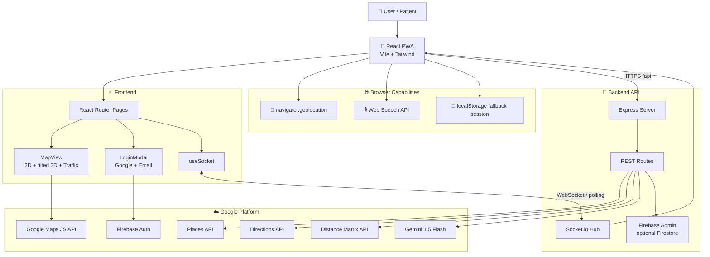
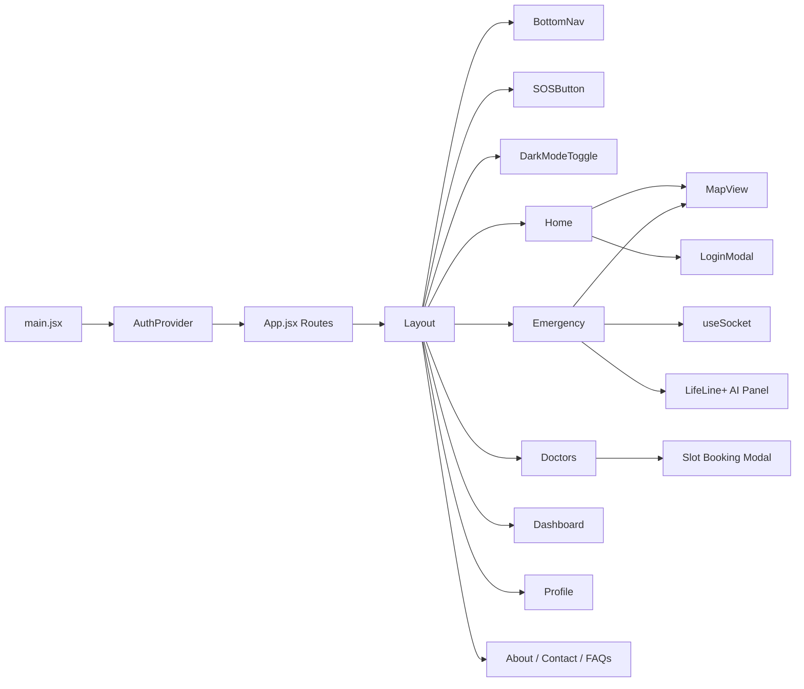
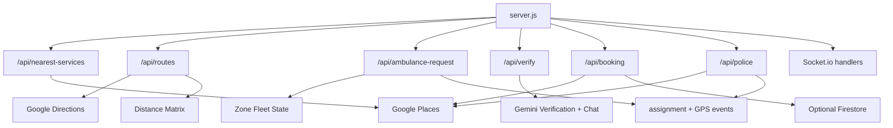
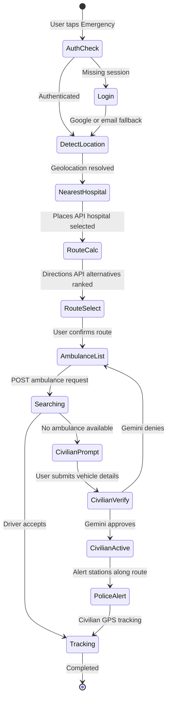
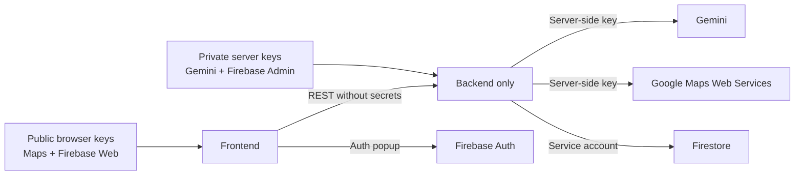
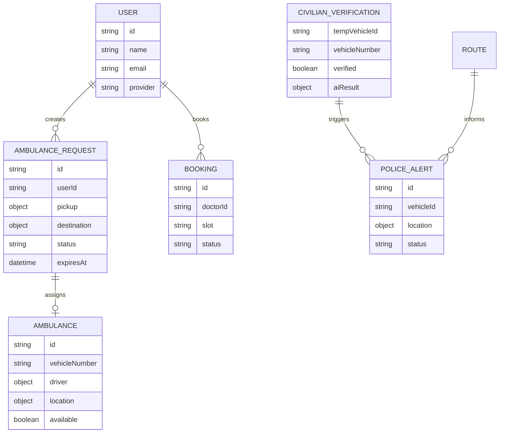
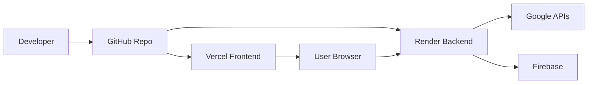

# 🏗️ System Architecture

Mermaid-based architecture diagrams for **LifeLine+**, the real-time emergency response and crisis coordination platform.

## 🌍 High-Level System

## 🧩 Frontend Component Graph

## 🧠 Backend Route Graph

## 🚑 Emergency State Machine

## 📡 Socket.io Events

| Event | Direction | Purpose |
| --- | --- | --- |
| `join_user` | Client to server | Subscribe to user-specific events |
| `join_request` | Client to server | Subscribe to ambulance request tracking |
| `join_ambulance` | Driver to server | Receive incoming ambulance requests |
| `join_civilian` | Client to server | Subscribe to civilian vehicle tracking |
| `new_ambulance_request` | Server to driver | Notify nearby ambulance rooms |
| `ambulance_assigned` | Server to client | Send driver and vehicle details |
| `ambulance_not_found` | Server to client | Trigger alternative/civilian flow |
| `location_update` | Server to client | Move ambulance marker in real time |
| `ambulance_arrived` | Server to client | Complete tracking phase |
| `track_civilian` | Client to server | Publish civilian emergency vehicle GPS |
| `civilian_location` | Server to client | Broadcast civilian GPS |
| `police_alert` | Server to clients | Notify route police alerts |

## 🔐 Security Boundaries

## 🗃️ Runtime Data Model

## 🚀 Deployment View

See [CORE_LOGIC.md](CORE_LOGIC.md) for process-level pipelines and [INSTRUCTIONS.md](INSTRUCTIONS.md) for file-by-file operations.
  
## License  
This project is licensed under the [LICENSE](LICENSE) file. 
